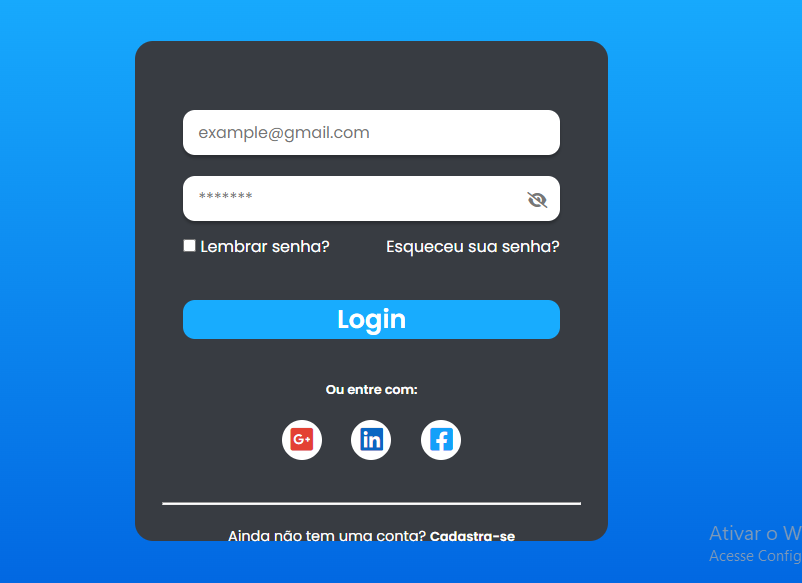

#   Projeto: Login-Helper

## Descrição:
Projeto, formulário de login, com input de senha, mostrando ou escondendo a senha do usuário.

[🔗 Clique aqui para acessar o site Login-Helper](https://marcos-franco.github.io/FormularioLogin/)

## 🛠 Tecnologias:

- HTML
- CSS
- Javascript
- Git
- Github

## Status do Projeto:
100% Concluído

## Autor:
Projeto desenvolvido por [Marcos Franco](https://www.linkedin.com/in/marcosfranco-5b1a8a111/)

## 💛 Contatos:

Linkedin: https://www.linkedin.com/in/marcosfranco-5b1a8a111/

Repositório Github: https://github.com/marcos-franco

WhatSapp: https://contate.me/marcos-franco

E-mail: masf68@hotmail.com
